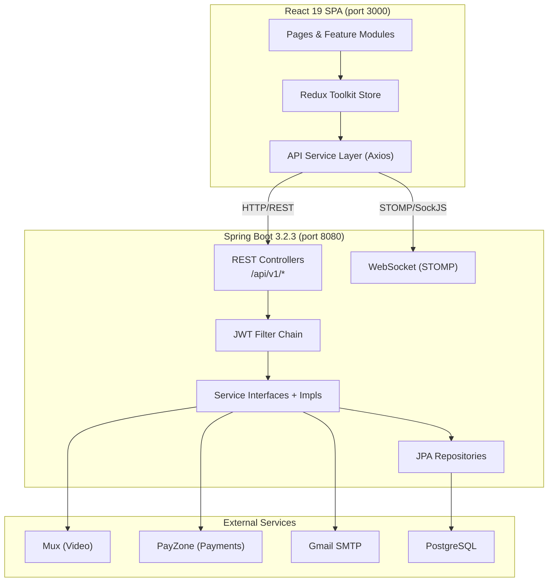
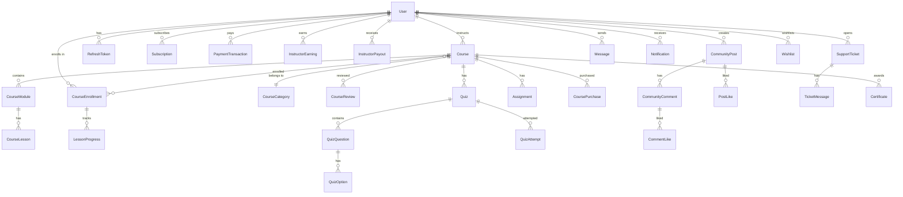
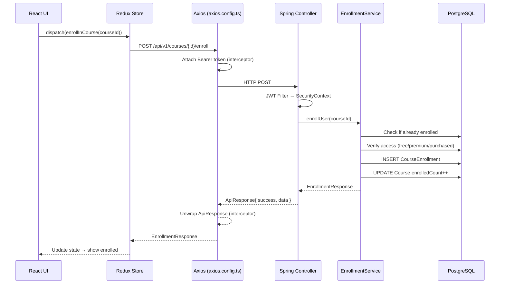

# Cake Design Academy — Full Project Technical Audit

> **SARALOWE** · E-Learning Platform for Cake Design  
> Read-only analysis — no code changes made.

---

## PROJECT OVERVIEW

This is a **full-stack e-learning platform** ("Cake Design Academy" / "SARALOWE") for teaching cake design. It supports three user roles — **Student**, **Instructor**, and **Admin** — with the following high-level capabilities:

| Area | Description |
|------|-------------|
| **Course Management** | Instructors create courses with modules, lessons (video/text/quiz), and assignments. Admins review and approve them. |
| **Video Streaming** | Video content is hosted via **Mux** (upload, transcoding, signed playback URLs). |
| **Subscriptions & Payments** | Yearly subscription via **PayZone** payment gateway (1 200 MAD/year). Individual course purchases are also supported. |
| **Quizzes & Certificates** | Students take quizzes, and upon course completion receive PDF certificates (generated with **iText**). |
| **Community** | Posts (Discussion, Question, Showcase, Announcement) with comments and likes. |
| **Messaging** | 1-to-1 messaging between users via WebSocket (STOMP over SockJS). |
| **Support Tickets** | Students raise tickets; admins respond. |
| **Admin Dashboard** | User management, course moderation, analytics, transactions, subscriptions. |

---

## ARCHITECTURE



**Pattern:** Layered architecture — Controller → Service (interface + impl) → Repository (Spring Data JPA). The backend uses a standard **Spring Boot** stack with no hexagonal or CQRS patterns. The frontend follows a **feature-module** pattern with centralized state via Redux Toolkit.

---

## BACKEND ANALYSIS

### Tech Stack
- **Java 17**, Spring Boot **3.2.3**
- **PostgreSQL** (Flyway migrations V1–V6)
- **JPA/Hibernate** (validate mode — schema managed by Flyway)
- **Spring Security** (stateless JWT)
- **Lombok** for boilerplate
- **Swagger/OpenAPI** via SpringDoc

### Package Structure

```
com.academy
├── config/          5 files   — Security, WebMvc, OpenApi, Async, Scheduler
├── controller/     19 files   — REST endpoints
├── dto/
│   ├── request/    24 files   — Inbound DTOs
│   └── response/   36 files   — Outbound DTOs
├── entity/         30 files   — JPA entities + 18 enums
├── exception/       6 files   — Custom exceptions + GlobalExceptionHandler
├── integration/     2 dirs    — Mux + PayZone clients
├── repository/     27 files   — Spring Data JPA repos
├── security/        5 files   — JWT auth pipeline
├── service/        22 interfaces + 22 impls
├── util/                      — Utility classes
└── websocket/       3 files   — STOMP config + auth interceptor
```

### Controllers (19)

| Controller | Prefix | Purpose |
|------------|--------|---------|
| [AuthController](file:///c:/Users/asus/Documents/Project%20main/plateforme/academy-backend/src/main/java/com/academy/controller/AuthController.java#19-108) | `/api/v1/auth` | Register, login, refresh, logout, email verify, password reset, `/me` |
| `CourseController` | `/api/v1/courses` | CRUD, search, filter, curriculum, slug lookup |
| `CategoryController` | `/api/v1/categories` | Course category CRUD |
| `InstructorController` | `/api/v1/instructor` | Dashboard, course management, modules, lessons, video upload, students, earnings, payouts, announcements, assignments |
| `AdminController` | `/api/v1/admin` | Dashboard, user management, course approval/rejection, analytics |
| `PaymentController` | `/api/v1/payments` | Initiate purchase, webhook callback |
| `SubscriptionController` | `/api/v1/subscriptions` | Plans, subscribe, cancel, webhook |
| `QuizController` | `/api/v1/quizzes` | CRUD for quizzes (instructor) |
| `StudentQuizController` | `/api/v1/student/quizzes` | Start, submit, results |
| `StudentAttemptController` | `/api/v1/student/attempts` | Quiz attempt history |
| `CertificateController` | `/api/v1/certificates` | Generate, download, verify |
| `CommunityController` | `/api/v1/community` | Posts, comments, likes |
| `MessageController` | `/api/v1/messages` | Conversations, send/receive |
| `NotificationController` | `/api/v1/notifications` | List, mark read, preferences |
| `ProfileController` | `/api/v1/profile` | Update profile, avatar upload, change password |
| `LessonController` | `/api/v1/lessons` | Lesson detail, video URL, progress tracking |
| `AssignmentController` | `/api/v1/assignments` | Assignment CRUD |
| `StudentTicketController` | `/api/v1/tickets` | Student ticket creation |
| `AdminTicketController` | `/api/v1/admin/tickets` | Admin ticket management |

### Entity Model (30 entities)



**Key design:** All entities extend [BaseEntity](file:///c:/Users/asus/Documents/Project%20main/plateforme/academy-backend/src/main/java/com/academy/entity/BaseEntity.java#12-30) (UUID primary key, `createdAt`, `updatedAt` with Hibernate timestamps).

### Services (22 service interfaces, 22 implementations)

The largest/most complex:
- **`CourseServiceImpl`** (21 KB) — Course CRUD, filtering, pagination, slug generation, thumbnail upload, publish/archive/approve workflow
- **`EnrollmentServiceImpl`** (17 KB) — Enrollment logic, access control (free/premium/purchased), progress tracking, subscription-based auto-enrollment
- **`CertificateServiceImpl`** (17 KB) — PDF generation with iText, certificate numbering
- **`CommunityServiceImpl`** (16 KB) — Posts, comments, likes with pagination
- **`QuizServiceImpl`** (16 KB) — Quiz CRUD, attempt management, scoring
- **`InstructorServiceImpl`** (15 KB) — Dashboard aggregation, earnings, payouts
- **`PaymentServiceImpl`** (14 KB) — PayZone integration, webhook processing
- **`AuthServiceImpl`** (11 KB) — Registration, login, JWT generation, email verification, password reset
- **`AdminServiceImpl`** (11 KB) — Admin dashboard, user management, analytics
- **`SupportTicketServiceImpl`** (12 KB) — Ticket lifecycle
- **`SubscriptionServiceImpl`** (10 KB) — Yearly subscription management

### Security

| Component | Role |
|-----------|------|
| [JwtTokenProvider](file:///c:/Users/asus/Documents/Project%20main/plateforme/academy-backend/src/main/java/com/academy/security/JwtTokenProvider.java#15-88) | Generates/validates JWT tokens (HMAC-SHA with secret from config) |
| [JwtAuthenticationFilter](file:///c:/Users/asus/Documents/Project%20main/plateforme/academy-backend/src/main/java/com/academy/security/JwtAuthenticationFilter.java#20-59) | Extracts Bearer token → validates → loads `UserDetails` → sets `SecurityContext` |
| `CustomUserDetailsService` | Loads user by ID/email from DB; returns `UserPrincipal` |
| `JwtAuthenticationEntryPoint` | Returns 401 JSON for unauthenticated requests |
| [SecurityConfig](file:///c:/Users/asus/Documents/Project%20main/plateforme/academy-backend/src/main/java/com/academy/config/SecurityConfig.java#23-99) | Stateless sessions, CSRF disabled, CORS `*`, permission matrix (public / ADMIN / INSTRUCTOR) |

**Auth flow:** `POST /auth/login` → returns `{ accessToken, refreshToken, user }` → client stores in `localStorage` → Axios interceptor attaches `Bearer` header → on 401, auto-refresh via `POST /auth/refresh-token`.

### Database Migrations (6 Flyway scripts)

| Version | Purpose |
|---------|---------|
| V1 | Initial schema — all core tables |
| V2 | Quiz tables |
| V3 | Assignments table |
| V4 | Certificate template column on courses |
| V5 | Support tickets |
| V6 | Quiz attempts |

### Third-Party Integrations

| Service | Purpose | Integration Point |
|---------|---------|-------------------|
| **Mux** | Video upload, transcoding, signed playback | `integration/mux/` + lesson service |
| **PayZone** | Payment processing (course purchase & subscription) | `integration/payzone/` + webhook controller |
| **Gmail SMTP** | Email verification, password reset, notifications | `EmailServiceImpl` via Spring Mail + Thymeleaf templates |
| **iText 7** | PDF certificate generation | `CertificateServiceImpl` |

---

## FRONTEND ANALYSIS

### Tech Stack
- **React 19** + **TypeScript 4.4** (Create React App)
- **Redux Toolkit** for state management
- **Axios** for API communication
- **Ant Design** + **Bootstrap 5** + **SASS** for UI
- **react-router-dom v7** for routing
- **Mux Player React** for video playback

### Directory Structure

```
src/
├── components/         12 items — shared UI components
├── context/             1 item  — React context
├── core/
│   ├── common/         35 items — Header, Footer, Sidebar, etc.
│   └── redux/           9 files — Store + 7 slices
├── environment.tsx              — API URL, token keys, config
├── feature-module/
│   ├── router/          3 files — Routes definition + links
│   ├── auth/           10 items — Login, Register, ForgotPassword, OTP
│   ├── HomePages/      80 items — Landing pages, home variants
│   ├── Courses/        12 items — Course grid, list, details, watch, resume
│   ├── Instructor/     31 items — Dashboard, course management, settings, ...
│   ├── student/        22 items — Dashboard, courses, quizzes, certificates, ...
│   ├── admin/           9 items — Dashboard, users, courses, categories, ...
│   ├── Pages/          18 items — About, contact, FAQ, pricing, errors
│   ├── blog/           10 items — Blog pages
│   ├── common/          2 items
│   ├── feature.tsx              — Main layout (public header/footer vs. dashboard)
│   └── authFeature.tsx          — Auth layout wrapper
├── services/api/       16 files — API service layer
├── style/            9493 items — SCSS theme files
└── types/               1 file
```

### Routing System

Routes are defined as a flat object in [all_routes.tsx](file:///c:/Users/asus/Documents/Project%20main/plateforme/template/src/feature-module/router/all_routes.tsx) with ~120 route constants. The layout splits into two modes via [feature.tsx](file:///c:/Users/asus/Documents/Project%20main/plateforme/template/src/feature-module/feature.tsx):

1. **Public pages** — wrapped in `Header` + `Footer` (homepage, courses, blog, about, etc.)
2. **Dashboard pages** — prefixed with `/student/`, `/instructor/`, `/admin/` — use a separate "Luxury Dashboard Layout" with sidebar navigation.

Auth pages (`/login`, `/register`, `/forgot-password`) use [authFeature.tsx](file:///c:/Users/asus/Documents/Project%20main/plateforme/template/src/feature-module/authFeature.tsx) as their own layout.

### State Management (Redux Toolkit)

| Slice | Purpose |
|-------|---------|
| `authSlice` | User auth state, login/register/logout thunks |
| `courseSlice` | Course listings, categories, current course |
| `studentSlice` | Enrollments, progress, certificates |
| `instructorSlice` | Instructor dashboard, courses, earnings |
| `adminSlice` | Admin dashboard, user/course management |
| `sidebarSlice` | Sidebar open/close state |
| `themeSettingSlice` | Theme toggle state |

### API Service Layer (16 files)

| Service | Endpoints Called |
|---------|-----------------|
| [auth.service.ts](file:///c:/Users/asus/Documents/Project%20main/plateforme/template/src/services/api/auth.service.ts) | `/auth/*` — login, register, logout, refresh, verify, password reset |
| [course.service.ts](file:///c:/Users/asus/Documents/Project%20main/plateforme/template/src/services/api/course.service.ts) | `/courses/*`, `/categories/*`, `/lessons/*` — browsing, enrollment, reviews, progress |
| [instructor.service.ts](file:///c:/Users/asus/Documents/Project%20main/plateforme/template/src/services/api/instructor.service.ts) | `/instructor/*` — dashboard, CRUD courses/modules/lessons, upload, earnings, payouts, students, announcements, assignments |
| [admin.service.ts](file:///c:/Users/asus/Documents/Project%20main/plateforme/template/src/services/api/admin.service.ts) | `/admin/*` — dashboard, users, courses, categories, transactions, subscriptions |
| [quiz.service.ts](file:///c:/Users/asus/Documents/Project%20main/plateforme/template/src/services/api/quiz.service.ts) | `/quizzes/*`, `/student/quizzes/*` — quiz CRUD, attempts |
| [subscription.service.ts](file:///c:/Users/asus/Documents/Project%20main/plateforme/template/src/services/api/subscription.service.ts) | `/subscriptions/*` — plans, subscribe, cancel, status |
| [payment.service.ts](file:///c:/Users/asus/Documents/Project%20main/plateforme/template/src/services/api/payment.service.ts) | `/payments/*` — initiate purchase |
| [certificate.service.ts](file:///c:/Users/asus/Documents/Project%20main/plateforme/template/src/services/api/certificate.service.ts) | `/certificates/*` — generate, download, verify |
| [community.service.ts](file:///c:/Users/asus/Documents/Project%20main/plateforme/template/src/services/api/community.service.ts) | `/community/*` — posts, comments, likes |
| [message.service.ts](file:///c:/Users/asus/Documents/Project%20main/plateforme/template/src/services/api/message.service.ts) | `/messages/*` — conversations, send/receive |
| [notification.service.ts](file:///c:/Users/asus/Documents/Project%20main/plateforme/template/src/services/api/notification.service.ts) | `/notifications/*` — list, mark read |
| [profile.service.ts](file:///c:/Users/asus/Documents/Project%20main/plateforme/template/src/services/api/profile.service.ts) | `/profile/*` — update, avatar, password |
| [ticket.service.ts](file:///c:/Users/asus/Documents/Project%20main/plateforme/template/src/services/api/ticket.service.ts) | `/tickets/*`, `/admin/tickets/*` — support tickets |

**Axios Configuration:** Two instances — `api` (JSON, 30s timeout) and `apiMultipart` (multipart, 60s timeout). Both include:
- **Request interceptor:** Attaches `Bearer` token from `localStorage`.
- **Response interceptor:** Unwraps the [ApiResponse](file:///c:/Users/asus/Documents/Project%20main/plateforme/template/src/services/api/types.ts#5-10) wrapper (`{ success, message, data }` → extracts `data`). On 401, auto-retries with refreshed token.

### TypeScript Types

[types.ts](file:///c:/Users/asus/Documents/Project%20main/plateforme/template/src/services/api/types.ts) (701 lines) mirrors the backend DTOs precisely — [User](file:///c:/Users/asus/Documents/Project%20main/plateforme/template/src/services/api/types.ts#35-49), [Course](file:///c:/Users/asus/Documents/Project%20main/plateforme/template/src/services/api/types.ts#136-171), [CourseModule](file:///c:/Users/asus/Documents/Project%20main/plateforme/template/src/services/api/types.ts#172-183), [CourseLesson](file:///c:/Users/asus/Documents/Project%20main/plateforme/template/src/services/api/types.ts#184-201), [Enrollment](file:///c:/Users/asus/Documents/Project%20main/plateforme/template/src/services/api/types.ts#239-258), [Quiz](file:///c:/Users/asus/Documents/Project%20main/plateforme/template/src/services/api/types.ts#603-622), [QuizAttempt](file:///c:/Users/asus/Documents/Project%20main/plateforme/template/src/services/api/types.ts#639-653), [Certificate](file:///c:/Users/asus/Documents/Project%20main/plateforme/template/src/services/api/types.ts#324-336), [CommunityPost](file:///c:/Users/asus/Documents/Project%20main/plateforme/template/src/services/api/types.ts#343-360), [Message](file:///c:/Users/asus/Documents/Project%20main/plateforme/template/src/services/api/types.ts#393-401), [Notification](file:///c:/Users/asus/Documents/Project%20main/plateforme/template/src/services/api/types.ts#422-431), [Subscription](file:///c:/Users/asus/Documents/Project%20main/plateforme/template/src/services/api/types.ts#282-296), [PaymentTransaction](file:///c:/Users/asus/Documents/Project%20main/plateforme/template/src/services/api/types.ts#297-314), [InstructorDashboard](file:///c:/Users/asus/Documents/Project%20main/plateforme/template/src/services/api/types.ts#459-476), [AdminDashboard](file:///c:/Users/asus/Documents/Project%20main/plateforme/template/src/services/api/types.ts#548-571), etc.

---

## DATA FLOW

### Example: Student enrolls in a free course



### Example: Instructor uploads a video lesson

1. Frontend calls `InstructorService.getVideoUploadUrl(lessonId)` → backend returns a Mux direct upload URL.
2. Frontend uses `@mux/mux-uploader-react` to upload video directly to Mux.
3. Mux sends a webhook to `POST /api/v1/mux/webhook` when the asset is ready.
4. Backend stores the Mux `assetId` and `playbackId` on the [CourseLesson](file:///c:/Users/asus/Documents/Project%20main/plateforme/template/src/services/api/types.ts#184-201).
5. When a student watches, `LessonController` generates a signed playback URL using the Mux private key.

---

## DEPENDENCIES

### Backend (Key Maven Dependencies)

| Dependency | Version | Purpose |
|------------|---------|---------|
| `spring-boot-starter-web` | 3.2.3 | REST API |
| `spring-boot-starter-data-jpa` | 3.2.3 | ORM / Data access |
| `spring-boot-starter-security` | 3.2.3 | Authentication / Authorization |
| `spring-boot-starter-mail` | 3.2.3 | Email sending |
| `spring-boot-starter-websocket` | 3.2.3 | WebSocket (STOMP) |
| `spring-boot-starter-thymeleaf` | 3.2.3 | Email HTML templates |
| `spring-boot-starter-validation` | 3.2.3 | Bean validation (@Valid) |
| `spring-boot-starter-actuator` | 3.2.3 | Health / metrics |
| `postgresql` | — | PostgreSQL JDBC driver |
| `flyway-core` | — | Database migrations |
| `jjwt-api/impl/jackson` | 0.12.5 | JWT token creation/validation |
| `springdoc-openapi` | 2.3.0 | Swagger UI |
| `itext7-core` | 7.2.5 | PDF certificate generation |
| `bucket4j-core` | 8.7.0 | Rate limiting (declared but usage not confirmed) |
| `hypersistence-utils` | 3.7.3 | PostgreSQL JSONB support |
| `httpclient5` | — | HTTP client for PayZone API |
| `slugify` | 3.0.6 | URL-friendly slug generation |
| `lombok` | — | Boilerplate reduction |

### Frontend (Key npm Dependencies)

| Dependency | Version | Purpose |
|------------|---------|---------|
| `react` / `react-dom` | 19.0.0 | Core framework |
| `typescript` | 4.4.2 | Type system |
| `@reduxjs/toolkit` / `react-redux` | 2.5.0 / 9.2.0 | State management |
| `axios` | 1.13.4 | HTTP client |
| `react-router-dom` | 7.1.1 | Client-side routing |
| `antd` | 5.23.0 | UI component library (Ant Design) |
| `bootstrap` / `react-bootstrap` | 5.3.3 / 2.10.7 | Additional UI components |
| `@mux/mux-player-react` | 3.11.4 | Mux video player |
| `@mux/mux-uploader-react` | 1.4.1 | Direct video upload to Mux |
| `sass` | 1.83.1 | SCSS compilation |
| `react-simple-wysiwyg` | 3.2.0 | Rich text editor |
| `primereact` | 10.9.1 | Additional UI components |
| `react-apexcharts` | 1.7.0 | Dashboard charts |
| `moment` | 2.30.1 | Date formatting |
| `react-slick` / `swiper` | — | Carousels/sliders |
| `@fortawesome/*` | — | Icon set |

---

## POTENTIAL ISSUES

### 🔴 Critical / Security

| # | Issue | Location | Impact |
|---|-------|----------|--------|
| 1 | **Secrets committed to [.env](file:///c:/Users/asus/Documents/Project%20main/plateforme/template/.env) and [.yml](file:///c:/Users/asus/Documents/Project%20main/plateforme/academy-backend/src/main/resources/application.yml)** — JWT secret, Mux credentials (including RSA private key), Gmail app password are all in plain text in version control. | [.env](file:///c:/Users/asus/Documents/Project%20main/plateforme/template/.env), [application.yml](file:///c:/Users/asus/Documents/Project%20main/plateforme/academy-backend/src/main/resources/application.yml) | **Critical security risk** — credentials exposed. These should be in a secrets manager or at minimum in [.gitignore](file:///c:/Users/asus/Documents/Project%20main/plateforme/template/.gitignore). |
| 2 | **CORS configured as `*` with credentials allowed** — `corsConfig.setAllowedOriginPatterns(List.of("*"))` + `setAllowCredentials(true)`. This is overly permissive. | [SecurityConfig.java](file:///c:/Users/asus/Documents/Project%20main/plateforme/academy-backend/src/main/java/com/academy/config/SecurityConfig.java) | Cross-site request attacks; should be restricted to the actual frontend domain. |
| 3 | **localStorage for JWT tokens** — Access and refresh tokens stored in `localStorage`, which is vulnerable to XSS attacks. | [axios.config.ts](file:///c:/Users/asus/Documents/Project%20main/plateforme/template/src/services/api/axios.config.ts), [auth.service.ts](file:///c:/Users/asus/Documents/Project%20main/plateforme/template/src/services/api/auth.service.ts) | Token theft via XSS. HttpOnly cookies are more secure. |
| 4 | **Admin registration endpoint is live** — `POST /api/v1/auth/register-admin` exists, guarded only by Spring profile check.  If profiles aren't set correctly in production, anyone can create admin accounts. | [AuthController.java](file:///c:/Users/asus/Documents/Project%20main/plateforme/academy-backend/src/main/java/com/academy/controller/AuthController.java) | Privilege escalation. |
| 5 | **`/actuator/**` endpoints are public** — Health, info, and metrics are accessible without authentication. | [SecurityConfig.java](file:///c:/Users/asus/Documents/Project%20main/plateforme/academy-backend/src/main/java/com/academy/config/SecurityConfig.java) | Information disclosure. |

### 🟡 Architectural / Design

| # | Issue | Location | Impact |
|---|-------|----------|--------|
| 6 | **Duplicate CORS configuration** — CORS is configured in both [SecurityConfig.java](file:///c:/Users/asus/Documents/Project%20main/plateforme/academy-backend/src/main/java/com/academy/config/SecurityConfig.java) (security filter) and [WebMvcConfig.java](file:///c:/Users/asus/Documents/Project%20main/plateforme/academy-backend/src/main/java/com/academy/config/WebMvcConfig.java) (MVC). These can conflict. | Config classes | Confusing behavior; hard to debug CORS issues. |
| 7 | **Duplicate Axios interceptor logic** — Both `api` and `apiMultipart` instances have identical interceptor code copy-pasted. | [axios.config.ts](file:///c:/Users/asus/Documents/Project%20main/plateforme/template/src/services/api/axios.config.ts) | Code duplication; fixes must be applied in two places. |
| 8 | **Route constants with duplicate paths** — Multiple instructor route keys point to `/instructor/instructor-withdraw` (wishlist, reviews, quiz attempts, orders, chat, referral). | [all_routes.tsx](file:///c:/Users/asus/Documents/Project%20main/plateforme/template/src/feature-module/router/all_routes.tsx) L42–47 | These pages will all render the same withdraw page. Likely placeholders never updated. |
| 9 | **`open-in-view: false`** but no documented strategy for lazy loading pitfalls — JPA lazy associations may throw `LazyInitializationException` if not properly fetched in the service layer. | [application.yml](file:///c:/Users/asus/Documents/Project%20main/plateforme/academy-backend/src/main/resources/application.yml) | Potential runtime errors on entity relationship access. |
| 10 | **No caching layer** — No Redis or in-memory cache for hot data (course listings, categories, platform stats). | Architecture | Performance bottleneck under load. |
| 11 | **`bucket4j-core` is declared but rate limiting may not be wired** — The dependency exists but no `@Configuration` or filter was found implementing rate limiting. | [pom.xml](file:///c:/Users/asus/Documents/Project%20main/plateforme/academy-backend/pom.xml) | Unused dependency; API is unprotected against abuse. |
| 12 | **Mixed UI libraries** — Ant Design, Bootstrap, PrimeReact, and raw SCSS are all used simultaneously. | [package.json](file:///c:/Users/asus/Documents/Project%20main/plateforme/template/package.json) | Bundle bloat, inconsistent styling, maintenance overhead. |
| 13 | **TypeScript version mismatch** — `typescript: ^4.4.2` is very old for a React 19 project. React 19 types expect TS 5+. | [package.json](file:///c:/Users/asus/Documents/Project%20main/plateforme/template/package.json) | Type errors; the [ts_errors.txt](file:///c:/Users/asus/Documents/Project%20main/plateforme/template/ts_errors.txt) (272 KB) confirms many type issues exist. |
| 14 | **Console logging in production interceptors** — `console.log()` calls left in the response interceptor for debugging. | [axios.config.ts](file:///c:/Users/asus/Documents/Project%20main/plateforme/template/src/services/api/axios.config.ts) L31–42 | Performance and information leakage in production. |
| 15 | **Flyway `validate-on-migrate: false`** — Schema validation is disabled during migration, which means Flyway won't detect schema drift. | [application.yml](file:///c:/Users/asus/Documents/Project%20main/plateforme/academy-backend/src/main/resources/application.yml) | Silent schema mismatches between migrations and entity definitions. |

### 🟠 Code Quality / Technical Debt

| # | Issue | Location | Impact |
|---|-------|----------|--------|
| 16 | **No unit/integration tests in the backend** — Only test dependencies exist; no test files were found in `src/test`. | `src/test/` | Zero test coverage; regressions will go undetected. |
| 17 | **272 KB of TypeScript errors** — [ts_errors.txt](file:///c:/Users/asus/Documents/Project%20main/plateforme/template/ts_errors.txt) exists with extensive compilation errors. | [template/ts_errors.txt](file:///c:/Users/asus/Documents/Project%20main/plateforme/template/ts_errors.txt) | The frontend likely doesn't compile cleanly. |
| 18 | **`moment.js` usage** — `moment` is a deprecated, heavy library (330 KB). Should use `date-fns` or `dayjs`. | [package.json](file:///c:/Users/asus/Documents/Project%20main/plateforme/template/package.json) | Bundle size; maintenance risk. |
| 19 | **Subscription model is hardcoded to yearly only** — Config has `yearly-price: 1200.00` with no monthly option implemented. | [application.yml](file:///c:/Users/asus/Documents/Project%20main/plateforme/academy-backend/src/main/resources/application.yml) | Limited flexibility for pricing. |
| 20 | **File upload directory `./uploads`** — Relative path; depends on working directory. Not suitable for containerized deployment. | [application.yml](file:///c:/Users/asus/Documents/Project%20main/plateforme/academy-backend/src/main/resources/application.yml) | Files may be lost on redeploy if not mounted as a volume. |

---

> **Summary:** The project is a well-structured, feature-rich e-learning platform with clean separation of concerns. The most urgent priorities are: (1) removing hardcoded secrets from VCS, (2) fixing the 272 KB of TypeScript errors, (3) tightening CORS and security, and (4) resolving the duplicate/placeholder routes. The architecture is solid for a monolithic application but would benefit from caching, proper tests, and production-hardening.
